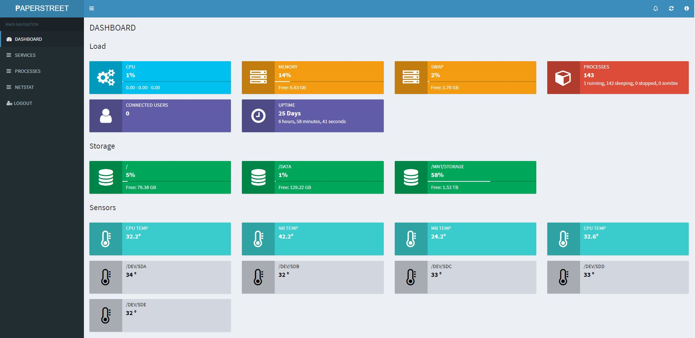

# M0N1T0R
PHP Linux System Monitor based on [AdminLTE](https://github.com/almasaeed2010/AdminLTE)

This script gives a glance on:
- Load
- Connected Users
- Storage
- Temperature Sensors (if hddtemp or sensors are installed)
- Services
- Processes
- Netstat

Just clone the repository on apache/php server.

The Default login/password is _admin_ / _admin_
To Change it, modify the `security.php` file and change :
- `$cred_login`
- `$cred_pass` (The password is hashed, and can be generate with: `password_hash("password", PASSWORD_DEFAULT)`
